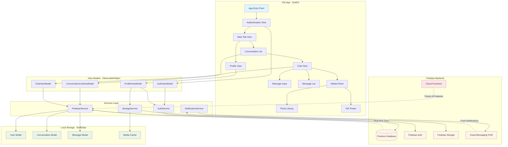

# MessageAI System Architecture

## Architecture Diagram

## Architecture Overview

### Layer 1: iOS App (SwiftUI)
The user interface layer built with SwiftUI, providing the visual experience for users.

**Components:**
- **App Entry Point**: Main app initialization and routing
- **Authentication View**: Sign up and sign in screens
- **Main Tab View**: Primary navigation container
- **Conversation List**: Display all user conversations
- **Profile View**: User profile management
- **Chat View**: Individual conversation interface
- **Message Input**: Text input and media attachment
- **Message List**: Scrollable message history
- **Media Picker**: Access to photos and GIF search

### Layer 2: View Models (ObservableObject)
MVVM architecture using SwiftUI's `ObservableObject` protocol for reactive UI updates.

**Components:**
- **AuthViewModel**: Manages authentication state and user session
- **ConversationListViewModel**: Handles conversation fetching and real-time updates
- **ChatViewModel**: Manages message sending, receiving, and conversation state
- **ProfileViewModel**: Handles profile data and updates

### Layer 3: Services Layer
Business logic and external service communication layer.

**Components:**
- **FirebaseService**: Core Firestore operations (CRUD, listeners, queries)
- **AuthService**: Firebase Authentication wrapper
- **StorageService**: Firebase Storage for media uploads/downloads
- **NotificationService**: Push notification handling and FCM token management

### Layer 4: Local Storage (SwiftData)
Client-side persistence for offline support and caching.

**Components:**
- **User Model**: Local user data cache
- **Conversation Model**: Conversation metadata and participants
- **Message Model**: Message history and pending sends
- **Media Cache**: Downloaded images and GIFs

### Layer 5: Firebase Backend
Cloud infrastructure providing real-time data sync, authentication, and storage.

**Components:**
- **Firestore Database**: NoSQL real-time database for messages, conversations, users
- **Firebase Auth**: User authentication and session management
- **Firebase Storage**: Binary storage for images, GIFs, and profile pictures
- **Cloud Messaging (FCM)**: Push notification delivery
- **Cloud Functions**: Serverless functions for AI features (Phase 2)

## Data Flow

### Message Sending Flow
1. User types message in **Message Input**
2. **ChatViewModel** receives input
3. Optimistic update to local **Message Model** (SwiftData)
4. **FirebaseService** sends to **Firestore Database**
5. Real-time sync confirms delivery
6. **Message Model** updated with server data
7. UI updates via **ChatViewModel** → **Message List**

### Real-Time Message Receiving Flow
1. **Firestore Database** receives new message
2. Real-time listener in **FirebaseService** triggers
3. **ChatViewModel** receives update
4. Message stored in **Message Model** (SwiftData)
5. **Message List** displays new message via SwiftUI binding

### Offline Message Flow
1. User sends message while offline
2. **Message Model** stores in pending queue
3. **NetworkMonitor** detects connectivity restored
4. **FirebaseService** processes pending queue
5. Messages sent to **Firestore Database**
6. Status updates reflected in UI

### Push Notification Flow
1. New message arrives in **Firestore Database**
2. **Cloud Functions** triggers (or direct FCM)
3. **Cloud Messaging (FCM)** delivers notification
4. **NotificationService** receives on device
5. Banner displays or app navigates to conversation

### Media Upload Flow
1. User selects image/GIF from **Media Picker**
2. **ChatViewModel** validates and compresses
3. **StorageService** uploads to **Firebase Storage**
4. URL returned and stored in message
5. **FirebaseService** creates message with media URL
6. **Media Cache** stores locally for quick access

## Key Design Decisions

### Why MVVM?
- Clean separation between UI and business logic
- SwiftUI's `ObservableObject` makes it natural
- Easy to test ViewModels independently
- Keeps views thin and focused on presentation

### Why SwiftData?
- Modern Apple-native persistence (iOS 17+)
- Seamless integration with SwiftUI
- Less boilerplate than Core Data
- Perfect for offline-first architecture

### Why Firebase?
- **Real-time sync out of the box** - critical for messaging
- Handles offline persistence automatically
- Generous free tier for MVP
- Proven scalability (used by production chat apps)
- Cloud Functions ready for AI features in Phase 2

### Why Services Layer?
- Centralizes Firebase logic
- Makes testing easier (can mock services)
- Prevents ViewModels from becoming too large
- Easier to switch backends if needed

### Offline-First Strategy
- **Local-first writes**: All messages saved to SwiftData immediately
- **Optimistic UI**: Users see their actions instantly
- **Background sync**: FirebaseService syncs when connected
- **Conflict resolution**: Server state always wins

## Scalability Considerations

### Current Architecture Supports:
- ✅ Thousands of messages per conversation (pagination)
- ✅ Hundreds of conversations per user
- ✅ Real-time updates for dozens of active chats
- ✅ Offline operation for extended periods
- ✅ Multiple devices per user (via Firestore sync)

### Future Enhancements (Post-MVP):
- **Cloud Functions** for AI features (already in diagram)
- **Firestore indexes** for complex queries
- **Cloud Storage CDN** for faster media delivery
- **Firebase Performance Monitoring** for optimization
- **Crashlytics** for error tracking

## Security Architecture

### Authentication Flow
1. User credentials → **AuthService** → **Firebase Auth**
2. Auth token stored securely in iOS Keychain
3. Token automatically refreshed by Firebase SDK
4. All Firestore requests include auth token

### Data Access Rules
- **Firestore Security Rules** enforce:
  - Users can only read/write their own data
  - Conversation access requires participantId match
  - Messages require conversation membership
- **Storage Security Rules** enforce:
  - Authenticated users only
  - 10MB file size limit
  - Valid file types only

### Data Privacy
- Messages encrypted in transit (TLS)
- Firestore encrypts data at rest
- No end-to-end encryption in MVP (future enhancement)
- Profile pictures stored with secure URLs

## Technology Stack Summary

| Layer | Technology | Purpose |
|-------|-----------|---------|
| **Frontend** | SwiftUI | Declarative UI framework |
| **Architecture** | MVVM | Separation of concerns |
| **Local Storage** | SwiftData | Offline persistence |
| **Backend** | Firebase Firestore | Real-time NoSQL database |
| **Authentication** | Firebase Auth | User management |
| **Storage** | Firebase Storage | Media hosting |
| **Notifications** | FCM | Push notifications |
| **Media** | SDWebImage | Animated GIF support |
| **GIF Search** | Giphy SDK | GIF picker integration |
| **Networking** | URLSession | HTTP requests |
| **Reactive** | Combine | Async event handling |

## Development Workflow

### Local Development
1. Xcode builds and runs on simulator
2. Firebase SDK connects to development project
3. SwiftData stores to local device/simulator
4. Hot reload for rapid iteration

### Testing
1. Unit tests for ViewModels and Services
2. UI tests for critical user flows
3. Integration tests with Firebase Emulator (optional)
4. Manual testing on physical devices

### Deployment
1. Code review and merge to main
2. Build via Xcode
3. TestFlight for beta testing
4. App Store for production (post-MVP)

---

**Note:** This architecture is designed for the 24-hour MVP. Cloud Functions (shown in red) are not implemented in MVP but are positioned for Phase 2 AI features.